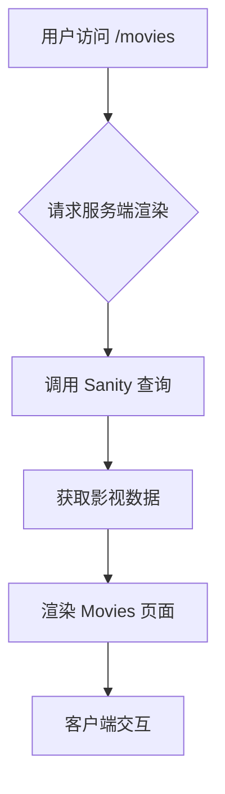
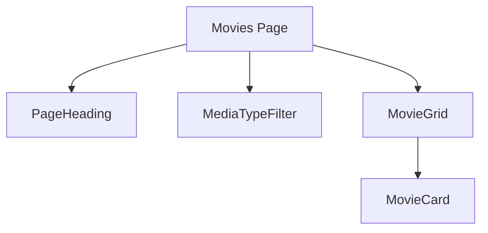

# Movies 分享页面设计文档

## 概述

本设计旨在为 leyen.me 网站添加一个新的 Movies 页面，用于分享用户观看过的电影和电视剧。该页面将提供分类浏览功能，区分电影和电视剧，并以卡片形式展示每个作品的封面、评分和标题。

### 核心功能需求

- 按类型分类显示：电影/电视剧
- 卡片式布局展示作品信息：
  - 封面图片
  - 豆瓣评分（或烂番茄评分）
  - 作品名称
- 微交互动效增强用户体验
- 与现有网站主题风格保持一致

### 技术目标

- 集成到现有的 Next.js 应用架构中
- 使用 Sanity CMS 管理影视数据
- 延续现有项目的 UI 设计语言和交互规范

## 架构设计

### 整体架构

Movies 页面将遵循项目现有的页面结构模式，包括：
- 动态路由页面组件 (`app/movies/page.tsx`)
- Sanity 数据模型定义 (`schemas/movie.ts`)
- TypeScript 类型定义 (`types/index.ts`)
- 组件封装复用已有设计元素

### 数据流



### 文件结构

```
app/
├── movies/
│   ├── page.tsx           # 主页面组件
│   └── [slug]/            # 单个影视详情页（可选）
│       ├── page.tsx
│       └── loading.tsx
schemas/
├── movie.ts               # 影视数据模型定义
types/
├── index.ts               # 添加 MovieType 类型定义
lib/
├── sanity.query.ts        # 添加影视数据查询
```

## 数据模型设计

### Sanity Schema 定义

我们将创建一个新的 `movie` schema 来存储影视作品信息：

| 字段名 | 类型 | 必填 | 描述 |
|--------|------|------|------|
| title | string | 是 | 影视作品名称 |
| slug | slug | 是 | URL 友好的标识符 |
| mediaType | string (选项: "movie"/"tv") | 是 | 媒体类型：电影或电视剧 |
| coverImage | image | 是 | 封面图片 |
| rating | number | 否 | 豆瓣评分（1-10） |
| releaseDate | date | 否 | 发布日期 |
| director | string | 否 | 导演 |
| cast | array[string] | 否 | 主要演员列表 |
| description | text | 否 | 简短描述 |
| externalUrl | url | 否 | 豆瓣链接 |

### TypeScript 类型定义

在 `types/index.ts` 中新增接口定义：

```typescript
export type MovieType = {
  _id: string;
  title: string;
  slug: string;
  mediaType: "movie" | "tv";
  coverImage: {
    image: string;
    lqip: string;
    alt: string | null;
  };
  rating?: number;
  releaseDate?: string;
  director?: string;
  cast?: string[];
  description?: string;
  externalUrl?: string;
};
```

## 页面组件设计

### 主页面组件 (app/movies/page.tsx)

#### 页面结构

主页面将包含以下部分：
1. 页面标题与简介 (使用 PageHeading 组件)
2. 分类筛选控件 (电影/电视剧)
3. 影视作品卡片网格布局

#### 组件层级



### 影视卡片组件 (MovieCard)

#### 视觉设计要素

- 卡片风格：延续项目现有卡片设计语言
- 微交互效果：
  - 悬停时缩放过渡动画
  - 边框颜色变化反馈
  - 评分星标动效
- 响应式布局适配不同屏幕尺寸

#### 组件属性

| 属性 | 类型 | 描述 |
|------|------|------|
| movie | MovieType | 影视作品数据对象 |
| className | string | 自定义样式类名 |

## UI/UX 设计规范

### 视觉风格

- 保持与现有网站一致的设计语言：
  - 使用相同的字体、间距和色彩体系
  - 遵循暗色/亮色主题切换机制
  - 采用圆角卡片和微妙阴影效果

### 交互细节

- 卡片悬停效果：
  ```
  transition: transform 0.3s ease, box-shadow 0.3s ease;
  &:hover {
    transform: translateY(-5px);
    box-shadow: 0 10px 20px rgba(0,0,0,0.1);
  }
  ```
- 分类筛选器：
  - 默认激活状态指示
  - 平滑过渡动画
  - 键盘导航支持

### 响应式设计

| 断点 | 布局列数 | 说明 |
|------|----------|------|
| < 640px | 1列 | 移动设备优化 |
| 640px - 1024px | 2列 | 平板适配 |
| > 1024px | 3列 | 桌面端最佳体验 |

## 数据获取层

### Sanity 查询定义

在 `lib/sanity.query.ts` 中添加新的查询语句：

```typescript
// 获取所有影视作品
export const moviesQuery = groq`*[_type == "movie"] | order(releaseDate desc){
  _id,
  title,
  "slug": slug.current,
  mediaType,
  rating,
  releaseDate,
  director,
  description,
  externalUrl,
  coverImage {
    "image": asset->url,
    "lqip": asset->metadata.lqip,
    alt,
  }
}`;

// 根据媒体类型筛选
export const moviesByTypeQuery = groq`*[_type == "movie" && mediaType == $type] | order(releaseDate desc){
  // 同上字段
}`;
```

### API 调用封装

使用项目现有的 `sanityFetch` 方法进行数据获取，在页面组件中调用：

```typescript
const movies: MovieType[] = await sanityFetch({
  query: moviesQuery,
  tags: ["movie"]
});
```

## 样式与主题适配

### Tailwind CSS 类命名规范

延续项目已有的类命名习惯：
- 使用语义化的类名前缀
- 复用现有的颜色和间距变量
- 兼容深色模式的类切换

### 主题一致性保证

- 复用全局主题配置：
  - `dark:bg-primary-bg` 和 `bg-secondary-bg` 背景色
  - 文字颜色使用 `dark:text-zinc-400` 系列
  - 边框颜色保持一致性
- 继承全局动画时长和缓动函数

## 测试策略

### 单元测试覆盖

针对新组件编写单元测试：

| 组件 | 测试要点 |
|------|----------|
| MovieCard | 正确渲染各类数据字段<br>悬停状态样式变更<br>空值边界情况处理 |
| MediaTypeFilter | 分类切换功能<br>默认选中状态<br>无障碍访问支持 |
| Movies Page | 数据获取正确性<br>空状态展示<br>SEO 元数据设置 |

### 端到端测试场景

使用 Cypress 或类似工具验证完整流程：
1. 访问 `/movies` 路径能正常加载
2. 分类筛选功能按预期工作
3. 点击卡片跳转至详情页（如果实现）

## 集成考虑事项

### SEO 优化

- 设置页面元数据：
  ```typescript
  export const metadata: Metadata = {
    title: "Movies | Leyen",
    description: "Discover movies and TV shows watched by Leyen",
  };
  ```
- 结构化数据标记（JSON-LD）用于搜索引擎优化

### 性能优化措施

- 图片懒加载和低质量占位符 (LQIP)
- 数据缓存策略利用 Sanity 的标签失效机制
- 代码分割减少初始加载体积
- 响应式图片尺寸适配

### 可访问性支持

- 键盘导航完整性
- 屏幕阅读器友好的语义化 HTML 结构
- 色彩对比度符合 WCAG 标准
- ARIA 属性正确设置